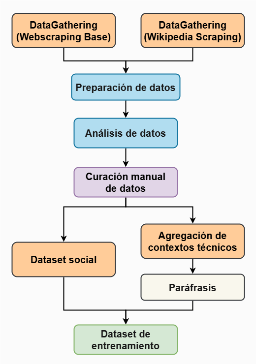
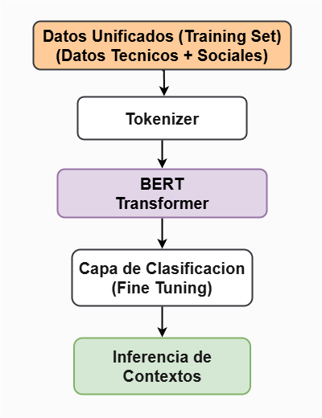

# Mori - Tu Asistente de Ciencia de Datos

Chatbot educativo entrenado para responder preguntas técnicas y sociales relacionadas con el procesamiento de datos, utilizando modelos de lenguaje avanzados y clasificación contextual.

## Introduction

El procesamiento de datos abarca múltiples disciplinas relacionadas, como la estadística, las matemáticas, el procesamiento de señales y la programación. Adquirir conocimientos en todas estas áreas puede representar un gran desafío, tanto para estudiantes como para personas con experiencia. En este contexto, el uso de herramientas como los chatbots puede ser de gran ayuda para responder dudas y explicar conceptos clave de manera clara y accesible.

Facilitar la comprensión de los conceptos relacionados con el procesamiento de datos, así como agilizar el acceso a sus definiciones, puede ayudar a que los estudiantes se mantengan motivados y enfocados, evitando la distracción o la frustración al enfrentar problemas complejos. Herramientas como GPT, Gemini y Copilot han demostrado ser valiosas para aumentar la productividad durante el desarrollo de proyectos. Del mismo modo, los chatbots educativos especializados pueden convertirse en aliados importantes para el aprendizaje y la exploración autónoma.

## Objetivo

El objetivo de este proyecto es desarrollar una herramienta similar a las mencionadas anteriormente, pero enfocada exclusivamente en responder preguntas relacionadas con definiciones de conceptos vinculados al procesamiento de datos. Este desarrollo puede considerarse un Producto Mínimo Viable (MVP) que sirve como punto de partida para evaluar su potencial.

A través de la implementación de esta solución, se busca analizar su usabilidad y viabilidad, con miras a una futura expansión. Esta expansión contemplaría el aumento del dataset utilizado para entrenar el modelo, así como la incorporación de conceptos pertenecientes a otras áreas del conocimiento.

## Composicion del Proyecto

Este proyecto está constituido principalmente por una carpeta de scripts, los cuales permiten la extracción de información mediante web scraping, así como el entrenamiento de modelos generativos basados en transformers preentrenados a través de fine-tuning. Adicionalmente, e igual de importante, este proyecto contiene un notebook de Jupyter llamado TrainingDatasetGeneration.ipynb, el cual se encarga de generar los datasets que se utilizan para entrenar a Mori.

### Arquitectura y archivos del proyecto

Más detalles acerca de la composición de archivos que conforman este proyecto se presentan a continuación.

#### 📁 Estructura de Archivos

```text
Mori/
├── Data/
│   ├── Dataset_Social_ParafrasisTecnico_Unificado.json        ← Dataset para entrenar el Clasificador BERT
│   ├── Parafrasis_Conceptos_Curados_Manualmente_Tecnico.json  ← Dataset para entrenar a Mori Técnico
│   └── Conceptos_Curados_Manualmente_Social.json              ← Dataset para entrenar a Mori Social
│
├── Notebooks/
│   ├── TrainingDatasetGeneration.ipynb   ← Notebook para el procesamiento y curación de datos
│   └── Folders_Adicionales/              ← Funciones y datos auxiliares usados por el notebook
│
├── Models/
│   ├── mori-context-model/     ← Clasificador BERT entrenado
│   ├── mori-tecnico-model/     ← Modelo T5 fine-tuned (técnico)
│   └── mori-social-model/      ← Modelo T5 fine-tuned (social)
│
├── Scripts/
│   ├── DataGathering.py              ← Script para web scraping general y libros
│   ├── DataGathering_Wikipedia.py    ← Script para scraping en Wikipedia (manual + SerpAPI)
│   ├── Training_MoriTecnico.py       ← Script para entrenar a Mori Técnico
│   ├── Training_MoriSocial.py        ← Script para entrenar a Mori Social
│   ├── Training_MoriClassifier.py    ← Script para entrenar el Clasificador BERT
│   └── Mori_Chatbot.py               ← Script principal para ejecutar al asistente Mori
```

## Generación del Dataset de Entrenamiento

El dataset de entrenamiento del chatbot Mori se genera mediante la implementación de técnicas de web scraping para extraer datos relevantes relacionados con el procesamiento de datos. Una vez obtenida esta información, se limpia, valida y procesa para asegurar su calidad y permitir su uso efectivo durante el entrenamiento del modelo.

Adicionalmente, los datos generados se curan manualmente para incrementar su calidad y validar su consistencia semántica. Por otro lado, se genera un dataset adicional orientado al contexto social, con el objetivo de que Mori pueda interactuar de forma más fluida y amigable con los usuarios, incluso fuera del dominio técnico.

Finalmente, se mejora la capacidad de generalización del modelo mediante la clasificación de los datos técnicos en contextos temáticos específicos y la aplicación de técnicas de paráfrasis, lo que permite al modelo comprender distintas formas de formular una misma pregunta.

A continuación, se presenta un diagrama de flujo que ilustra el proceso de generación del dataset de entrenamiento:

<p align="center">
  
</p>

## Generacion de Modelos Q&A de Mori

Una vez generados los datasets, técnico y social, el siguiente objetivo consiste en aplicar un ajuste fino sobre modelos de lenguaje preentrenados para desarrollar el modelo de preguntas y respuestas (Q&A) que utilizará Mori para responder preguntas relacionadas con el procesamiento de datos. Sin embargo, dado que Mori también incluye un componente conversacional basado en un dataset social independiente, es necesario implementar un mecanismo que permita clasificar la intención de la pregunta del usuario.

Este clasificador no solo permitirá determinar si la pregunta se enmarca dentro de un contexto social o técnico, sino que además posibilitará identificar el subcontexto técnico específico, como por ejemplo:

- datos
- evaluación
- aprendizaje
- estadística
- entre otros temas relevantes dentro del dominio del procesamiento de datos.

### Procedimiento para generar el clasificador de contextos

La implementacion del clasificador de contextos se basa en el uso de un modelo ***BERT*** preentrenado, sobre el cual se implementa un ajuste fino (*fine-tuning*) utilizando la clase *BertForSequenceClassification*. Esta arquitectura permite determinar el contexto de una pregunta basándose en su estructura semántica.

De forma complementaria, se utiliza el *BertTokenizer* para codificar las entradas (preguntas del usuario) y decodificar las respuestas generadas por el modelo. Todo el proceso se ilustra en la siguiente Figura:

<p align="center">
  
</p>

### Diagrama de funcionalidad de Mori

Una vez generado el *clasificador BERT*, se procede al entrenamiento de los modelos que conforman la solución final del asistente Mori.

Por un lado, se utiliza el dataset social para aplicar ajuste fino sobre un modelo preentrenado *T5-base* de *Google* (*Text-To-Text Transfer Transformer*), diseñado específicamente para tareas de tipo Q&A. En este caso, el fine-tuning permite al modelo aprender la relación entre preguntas sociales y sus respuestas correspondientes.

Por otro lado, el dataset técnico, enriquecido previamente con preguntas parafraseadas, se emplea para entrenar un segundo modelo *T5-base*. Sin embargo, a diferencia del enfoque social, en este caso se aplica una estrategia de ***prompt engineering*** para ayudar al modelo a entender el contexto temático de cada pregunta. La entrada al modelo se estructura de la siguiente manera:

***Entrada al modelo:*** <br>
    *"Context: {context} [SEP] Question: {question}"*

Esta estructura permite que el modelo técnico no solo relacione una pregunta con su respuesta, sino que lo haga considerando explícitamente el contexto técnico específico en el que se enmarca la consulta. Una vez entrenados ambos modelos (técnico y social), se integra la funcionalidad completa en el asistente Mori, siguiendo el flujo representado en la siguiente Figura:

<p align="center">
  
</p>

## Implementación de Mori

Actualmente, Mori puede utilizarse de dos formas principales:

- A través de la línea de comandos (Command Prompt en Windows o terminal en Linux/Mac).

- Mediante una interfaz web interactiva, desplegada en la plataforma 🤗 Hugging Face Spaces: https://huggingface.co/spaces/tecuhtli/Mori_Bot

En ambos casos, el funcionamiento del asistente es el mismo: Mori recibe una pregunta del usuario, clasifica su intención (técnica o social), y responde utilizando el modelo adecuado. La diferencia radica únicamente en la forma de interactuar con él.

A continuación, se muestran ejemplos del uso de Mori en ambas modalidades:

### Terminal / Command Prompt:

Interacción directa desde consola, útil para pruebas rápidas o integración en flujos de desarrollo local.

<p align="center">
  
</p>


### Plataforma Hugging Face:
    
Interfaz visual amigable que permite una experiencia conversacional más accesible, especialmente pensada para usuarios finales o presentaciones.

<p align="center">
  
</p>

📚 Créditos y agradecimientos

Desarrollado por *Alfonso Sanchez* con fines educativos y de investigación.

Agradecimiento especial a GPT, por ser una herramienta incansable que agiliza de gran manera el desarrollo de proyectos.También agradezco a Mori, por servir como referencia para la creación de este proyecto. Finalmente, un reconocimiento a Hugging Face y a la librería Transformers, por facilitar el desarrollo de modelos avanzados de lenguaje natural. 