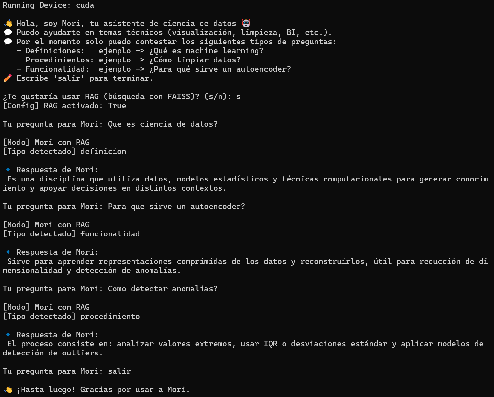
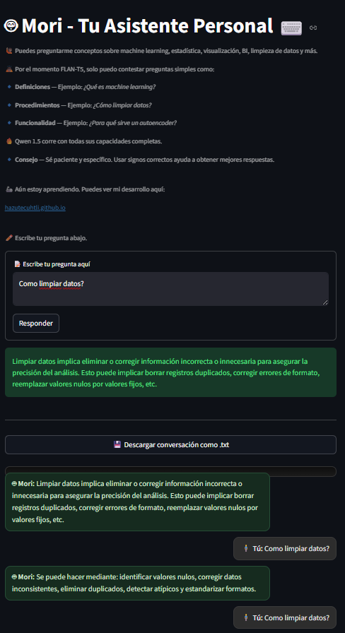
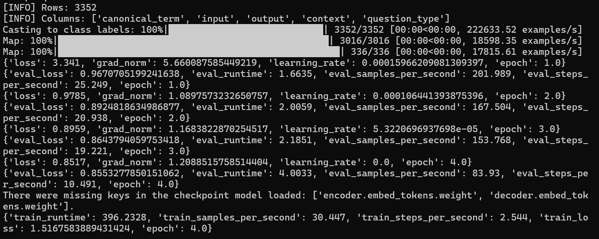
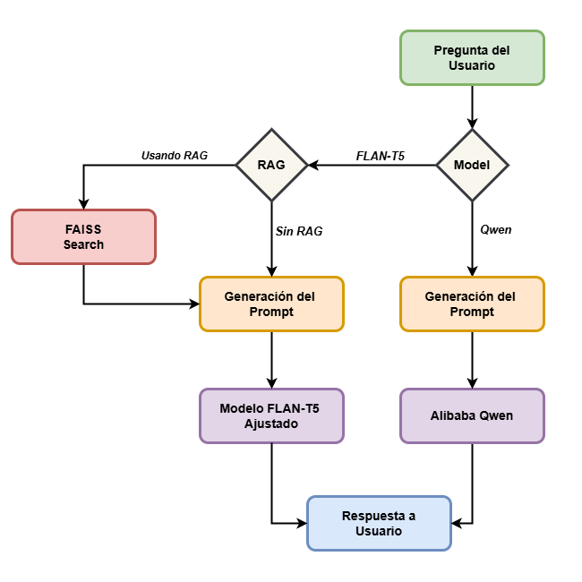

# Mori - Tu Asistente de Ciencia de Datos

Asistente personal especializado en responder preguntas sobre procesamiento de datos, basado en un modelo de lenguaje de gran tamaño (LLM) ajustado mediante fine-tuning y reforzado con recuperación de conocimiento (RAG). Adicionalmente, se incluye una versión alternativa que utiliza un modelo más robusto sin ajuste fino, empleada con fines comparativos y de experimentación.

## Introduction

El procesamiento de datos ha evolucionado de una especialización técnica a una herramienta de uso cotidiano, impulsada por el crecimiento en la disponibilidad de datos, el aumento del poder de cómputo y la reducción de sus costos. Esto ha permitido el desarrollo de tecnologías que facilitan el análisis y la comprensión de la información de manera más accesible y eficiente.

No obstante, al mismo tiempo que se ha facilitado la comprensión de los datos, el ecosistema formado por métodos, tecnologías y herramientas ha incrementado significativamente el volumen de conocimiento disponible relacionado con el procesamiento de datos. Hoy en día existen diversos formatos y enfoques para el almacenamiento, procesamiento y visualización de la información, los cuales dependen de factores como el tamaño de los datos, los recursos computacionales disponibles, la facilidad de despliegue y mantenimiento, así como la flexibilidad para su modificación y escalabilidad.

Aunado al ecosistema mencionado, el procesamiento de datos abarca múltiples disciplinas relacionadas, como la estadística, las matemáticas, el procesamiento de señales y la programación. Adquirir conocimientos sólidos en todas estas áreas puede representar un desafío considerable, tanto para estudiantes como para profesionales con experiencia. En este contexto, el uso de herramientas como los asistentes personales resulta de gran utilidad para resolver dudas y explicar conceptos clave de forma clara, estructurada y accesible.

Facilitar la comprensión de los conceptos relacionados con el procesamiento de datos, así como agilizar el acceso a sus definiciones, puede contribuir a que los estudiantes se mantengan motivados y enfocados, reduciendo la distracción o la frustración al enfrentarse a problemas complejos. Herramientas como GPT, Claude, Gemini y Copilot han demostrado ser valiosas para incrementar la productividad de los profesionales durante el desarrollo de proyectos. De manera similar, los asistentes educativos especializados pueden convertirse en aliados importantes para el aprendizaje y la exploración autónoma, al estar delimitados a dominios más acotados que aquellos que un profesional del procesamiento de datos puede llegar a requerir.

# Instalación


## Entorno recomendado

Crea y activa un entorno virtual para aislar dependencias. Se recomienda usar la carpeta en la **raíz del proyecto** (ej. `.venv`):

```bash
# Windows (PowerShell)
python -m venv .venv          # Crear entorno
.\.venv\Scripts\Activate.ps1  # Activar

# Windows (CMD)
python -m venv .venv
.\.venv\Scripts\activate.bat

# macOS / Linux (bash/zsh)
python3 -m venv .venv
source .venv/bin/activate
```

## Requisitos
- **Python** 3.10  
- (Opcional, GPU) **NVIDIA Driver** actualizado  
- (Opcional) **CUDA/cuDNN** a nivel sistema **solo si los necesitas**.  

  **Nota:** Si instalas PyTorch usando un wheel que ya incluye CUDA (por ejemplo cu118), no es necesario instalar CUDA/cuDNN localmente. En ese caso, basta con tener el driver de NVIDIA actualizado.

  *Ejemplo (configuración utilizada en este desarrollo):*
  - pip3 install torch --index-url https://download.pytorch.org/whl/cu118 (Usado en este desarrollo)

## Instalación (GPU)

Para más información sobre configuraciones compatibles con GPU, consulta la documentación oficial de [PyTorch](https://pytorch.org/get-started/locally/).

```bash
python -m pip install --upgrade pip
python -m pip install -r requirements.txt --extra-index-url https://download.pytorch.org/whl/cuXXX
```
*Reemplaza `cuXXX` por la versión de CUDA compatible con tu sistema (por ejemplo, `cu118`, `cu121`).*

## Instalación (CPU)

Instalación recomendada para sistemas **sin GPU NVIDIA** o con recursos de cómputo limitados.

```bash
python -m pip install --upgrade pip
python -m pip install -r requirements-cpu.txt --extra-index-url https://download.pytorch.org/whl/cpu
```

## Composicion del Proyecto

El proyecto se compone de dos aplicaciones y un conjunto de carpetas que almacenan los datos de entrenamiento, los modelos ajustados, la base de datos vectorial y los scripts necesarios para generar y utilizar estos recursos. Dichos scripts también contienen funciones compartidas que permiten el correcto funcionamiento de la interfaz del asistente personal. A continuación, se presenta un diagrama con una descripción general del rol que cumple cada componente dentro del proyecto.

#### 📁 Estructura de Archivos

```text
Mori/
├── Data/
│   ├── Mori_Technical_Concepts.json       ← Dataset compuesto por definiciones
│   ├── Mori_Technical_Functionality.json  ← Dataset compuesto por funcionalidades
│   ├── Mori_Technical_Procedures.json     ← Dataset compuesto por procedimientos
│   └── Mori_Technical_Final.parquet       ← Dataset generado a partir de los archivos JSON
│
├── Models/
│   └── mori-flan-vX.X    ← Modelo LLM ajustado mediante fine-tuning (Hugging Face)
│
├── Scripts/
│   ├── Mori_Technical_RAGwithFAISS.py      ← Generación de FAISS y recuperación de embeddings
│   ├── Mori_TechnicalDatasetGeneration.py  ← Consolidación de conocimiento de archivos JSON
│   ├── Mori_TechnicalTokenizer.py          ← Código para la tokenización de los datasets
│   ├── config.py                           ← Archivo de configuración central del proyecto
│   ├── TrainingMori_FineTuningFLANT5.py    ← Pipeline para el ajuste fino del modelo FLAN-T5
│   ├── Mori_TechnicalTrainer.py            ← Lógica de entrenamiento del modelo FLAN-T5
│   ├── Mori_TechnicalPrompts.py            ← Generación de prompts de inferencia
│   └── Mori_Chatbot_SpanishCorrections.py  ← Corrección de texto generado en español
│
├── Statistics/
│   ├── conversaciones_log.csv    ← Historial de interacciones con Mori (formato CSV)
│   └── conversaciones_log.jsonl  ← Historial de interacciones con Mori (formato JSONL)
│
├── Vec_DataBase/
│   ├── mori.faiss       ← Índice FAISS para almacenar y recuperar embeddings vectoriales
│   ├── mori_ids.npy     ← Identificadores asociados a cada vector del índice FAISS
│   └── mori_metas.json  ← Metadatos de los documentos indexados
│
├── MoriTechnical_FLANT5.py  ← Asistente personal Mori con interfaz en la terminal (CLI)
└── app.py                   ← Asistente personal Mori con interfaz web basada en Streamlit
```

## Uso del Asistente Personal

El asistente personal puede utilizarse a través de la terminal (línea de comandos) o mediante una interfaz web basada en Streamlit. La primera opción permite el uso exclusivo del modelo FLAN-T5 ajustado mediante fine-tuning, diseñado para responder dudas relacionadas con el procesamiento de datos. Por su parte, la interfaz web proporciona acceso a opciones adicionales para la generación de texto y configuración del asistente, las cuales se describen a continuación.

### Utilizando Mori desde la línea de comandos

Esta versión de Mori permite el acceso a un modelo ajustado mediante *fine-tuning* a partir de **Google FLAN-T5** (*Fine-tuned Language Net – T5*), una variante mejorada del modelo base **T5 (Text-to-Text Transfer Transformer)**.

Adicionalmente, esta interfaz permite el uso opcional de **generación aumentada por recuperación (RAG)**, basada en una base de datos vectorial construida con **FAISS (Facebook AI Similarity Search)**. Este enfoque mejora la calidad de las respuestas al incorporar información relevante recuperada dinámicamente, la cual se construye a partir del mismo dataset utilizado durante el proceso de ajuste fino del modelo FLAN-T5, sin necesidad de reentrenarlo.

Para utilizar Mori desde la terminal, es necesario ejecutar el siguiente comando una vez que el entorno de Python haya sido activado, tal como se explicó anteriormente. Dicho comando debe ejecutarse desde el directorio raíz del proyecto:

```bash
python MoriTechnical_FLANT5.py
```

#### Terminal / Command Prompt

Interacción directa desde consola, útil para pruebas rápidas o integración en flujos de desarrollo local.

<p align="center">  </p> ```

### Utilizando Mori con Streamlit

El uso del asistente personal a través de Streamlit ofrece un mayor nivel de flexibilidad sobre la forma en que se utiliza Mori. Esta interfaz permite no solo el uso del modelo FLAN-T5 ajustado mediante fine-tuning, sino también la opción de emplear un modelo más robusto y de mayor tamaño, específicamente Qwen (Tongyi Qianwen) de Alibaba. En este caso, el modelo se utiliza en su versión original, sin ajuste fino, con el objetivo de comparar las respuestas generadas por ambos enfoques.

De forma complementaria, la interfaz de Streamlit permite la selección de diferentes personalidades para el asistente personal, las cuales modifican el estilo y la forma en que se genera el texto mediante el ajuste de diversos hiperparámetros. Por último, la interfaz también ofrece la posibilidad de descargar la conversación en formato .txt, lo que permite almacenarla y consultarla posteriormente.

Para utilizar el asistente personal mediante Streamlit es necesario utilizar el siguieten comando, una vez que el entorno de Python haya sido activado, tal como se explicó anteriormente. Dicho comando debe ejecutarse desde el directorio raíz del proyecto:

```bash
streamlit run app.py --server.port 8502
```

#### Streamlit GUI

Interfaz visual amigable que permite una experiencia conversacional más accesible, especialmente pensada para usuarios finales o presentaciones.

<p align="center">
  
</p>


## Generación y uso de los datasets de entrenamiento

Para este proyecto, los datos de entrenamiento fueron generados de forma sintética, recurriendo a herramientas como GPT, Claude y Gemini. No obstante, los datos fueron curados manualmente con el objetivo de garantizar la exactitud del contenido, lo cual resulta crucial en un proyecto de esta índole.

Se generaron tres datasets, cada uno compuesto por un tipo específico de preguntas relacionadas con el procesamiento de datos, de la siguiente manera:

```markdown
| Archivo (JSON)               | Tipo de datos                       | Ejemplo                  |
|------------------------------|-------------------------------------|--------------------------|
| Mori_Technical_Concepts      | Definiciones de conceptos           | ¿Qué es ciencia de datos?|
| Mori_Technical_Functionality | Funcionalidades de modelos/técnicas | ¿Para qué sirve una CNN? |
| Mori_Technical_Procedures    | Procedimientos y pasos prácticos    | ¿Cómo limpiar datos?     |
```

Estos archivos se utilizan para consolidar la base de conocimiento con la cual se entrena el modelo FLAN-T5, que constituye la base del asistente personal Mori. Como resultado de este proceso, se genera un archivo en formato Parquet que concentra la información contenida en los distintos archivos JSON.

Este proceso se ejecuta mediante el siguiente comando, una vez que el entorno de Python ha sido activado, tal como se explicó anteriormente, y desde el directorio raíz del proyecto:

```bash
python -m Scripts.Mori_TechnicalDatasetGeneration
```

La estructura basada en archivos JSON permite ampliar el conocimiento de Mori de forma sencilla, ya sea incrementando el contenido de los archivos existentes o agregando nuevos archivos. Posteriormente, estos se consolidan en un único archivo Parquet, lo que facilita incorporar información adicional tanto para el entrenamiento como para el uso del asistente personal.


## Entrenamiento y ajuste fino del modelo FLAN-T5

El ajuste fino del modelo seleccionado se realiza utilizando **PyTorch**, a través de los scripts **TrainingMori_FineTuningFLANT5.py** y vMori_TechnicalTrainer.pyv, junto con el archivo de configuración **config.py**. Estos archivos se encuentran en la carpeta Scripts, ubicada en el directorio raíz del proyecto.

El modelo FLAN-T5 se obtiene directamente desde la plataforma **Hugging Face** en su versión base, sin modificaciones. Posteriormente, mediante el uso de **PyTorch** y la librería **Transformers**, el modelo es ajustado finamente (fine-tuning) utilizando como entrada el archivo Parquet generado previamente, el cual consolida el conocimiento disponible para el entrenamiento del asistente personal Mori.

El archivo **TrainingMori_FineTuningFLANT5.py** actúa como el orquestador del proceso de entrenamiento. Este script permite ejecutar un pipeline completo que incluye, de ser necesario, la generación del archivo Parquet consolidado, la creación de los conjuntos de datos de entrenamiento y validación, así como la tokenización de dichos datasets. Finalmente, este pipeline realiza el ajuste fino del modelo haciendo uso del script **Mori_TechnicalTrainer.py**, el cual encapsula la lógica de entrenamiento.

El entrenamiento del modelo se lleva a cabo mediante el siguiente comando, una vez que el entorno de Python ha sido activado, tal como se explicó anteriormente, y desde el directorio raíz del proyecto:

```bash
python -m Scripts.TrainingMori_FineTuningFLANT5
```

La ejecución del comando anterior permite observar el proceso de ajuste del modelo, evidenciado por la **reducción progresiva del error** durante el entrenamiento, tal como se muestra a continuación para un entrenamiento de **4 épocas**:

<p align="center">
  
</p>

No obstante, es posible **modificar** los parámetros de entrenamiento, los cuales se encuentran definidos en los archivos **Mori_TechnicalTrainer.py** y **config.py**, ubicados en la carpeta Scripts dentro del directorio raíz del proyecto.

Estos ajustes permiten adaptar el proceso de aprendizaje a distintas circunstancias, por ejemplo, cuando el contenido de los archivos que conforman la base de conocimiento utilizada para entrenar a Mori cambia, o cuando se dispone de diferentes recursos computacionales.

El entrenamiento de esta versión de Mori fue ejecutado utilizando una **GPU NVIDIA RTX 3070 Ti con 8 GB de memoria RAM**, y 40 epocas.

## Generación de la base de datos vectorial (RAG)

Además del ajuste fino del modelo FLAN-T5, el proyecto incorpora un enfoque de **Generación Aumentada por Recuperación (RAG, Retrieval-Augmented Generation)**, cuyo objetivo es mejorar la calidad y precisión de las respuestas sin necesidad de reentrenar el modelo.

Para ello, se construye una base de datos vectorial utilizando **FAISS (Facebook AI Similarity Search)**, la cual permite almacenar y recuperar **representaciones vectoriales (embeddings)** de los documentos que conforman la base de conocimiento de Mori.

La base de datos vectorial se genera a partir del **archivo Parquet consolidado**, el mismo que se utiliza durante el proceso de entrenamiento del modelo FLAN-T5. Dicho archivo contiene definiciones, funcionalidades y procedimientos relacionados con el procesamiento de datos, previamente curados y estructurados.

Cada registro del dataset es transformado en un texto representativo y posteriormente convertido en un embedding numérico mediante un modelo de sentence embeddings, específicamente el modelo **intfloat/multilingual-e5-base**.

### Proceso de generación

El proceso de construcción de la base de datos vectorial consiste en los siguientes pasos:

- Cargar el archivo Parquet consolidado.
- Construir una representación textual para cada registro.
- Generar embeddings vectoriales para cada texto utilizando el modelo E5.
- Almacenar los embeddings en un índice FAISS.
- Guardar metadatos e identificadores asociados a cada vector.

Este proceso se ejecuta mediante el siguiente comando, una vez que el entorno de Python ha sido activado y desde el directorio raíz del proyecto:

```bash
python -m Scripts.Mori_Technical_RAGwithFAISS
```

### Archivos generados

Como resultado de este proceso, se generan los siguientes archivos dentro de la carpeta **Vec_DataBase** ubicada en la carpeta raiz del proyecto:

- mori.faiss: Índice FAISS que almacena los embeddings vectoriales.
- mori_ids.npy: Identificadores únicos asociados a cada vector del índice.
- mori_metas.json: Metadatos de los documentos indexados (término, contexto, tipo de pregunta, etc.).

### Ventajas del enfoque RAG

El uso de una base de datos vectorial permite que Mori:

- Recupere información relevante de forma dinámica durante la inferencia.
- Incorpore nuevo conocimiento sin necesidad de reentrenar el modelo.
- Reduzca costos computacionales asociados al ajuste fino.
- Mantenga una arquitectura flexible y escalable.

Este enfoque resulta especialmente útil cuando la base de conocimiento evoluciona con el tiempo, ya que basta con regenerar la base de datos vectorial para reflejar los cambios.


## Uso de RAG durante la inferencia

Una vez generada la base de datos vectorial, Mori puede utilizar el enfoque de Generación Aumentada por Recuperación (**RAG**) durante la fase de inferencia, es decir, en el momento en que el usuario realiza una consulta.

A diferencia del ajuste fino del modelo, el uso de RAG no modifica los pesos del modelo. En su lugar, permite enriquecer dinámicamente las respuestas del asistente mediante la recuperación de información relevante desde la base de conocimiento externa.

Cuando RAG está habilitado, el proceso de generación de una respuesta sigue los siguientes pasos:

- La pregunta del usuario es convertida en un embedding vectorial.
- Dicho embedding se utiliza para consultar el índice FAISS.
- Se recuperan los documentos más similares desde la base de datos vectorial.
- El contenido recuperado se incorpora como contexto adicional.
- El modelo de lenguaje genera una respuesta basada tanto en la pregunta original como en el contexto recuperado.

Este flujo permite que el modelo genere respuestas más precisas y contextualizadas, especialmente en preguntas específicas o técnicas.

### Ventajas del uso de RAG durante la inferencia

En el contexto de Mori, el ajuste fino del modelo FLAN-T5 proporciona una base sólida de comprensión del dominio, mientras que RAG actúa como un mecanismo de recuperación de conocimiento especializado.

De esta forma, ambos enfoques se complementan:

- Fine-tuning: aprendizaje general del dominio y del estilo de respuesta.
- RAG: acceso dinámico a información específica y estructurada.

Este diseño permite que Mori combine lo mejor de ambos mundos, ofreciendo respuestas coherentes, contextualizadas y alineadas con la base de conocimiento disponible. Adicionalmente, y de igual importancia, este enfoque permite incrementar el conocimiento de Mori sin necesidad de modificar los pesos del modelo, lo cual reduce la frecuencia con la que es necesario realizar nuevos procesos de entrenamiento, gracias al uso de RAG.

### Diagrama de funcionalidad de Mori

El siguiente diagrama ilustra la arquitectura de inferencia de Mori y resume el flujo completo desde la entrada de una pregunta por parte del usuario hasta la generación de la respuesta final. En él se muestran los dos caminos principales de generación de texto: uno basado en un modelo FLAN-T5 ajustado mediante fine-tuning, con soporte opcional de Generación Aumentada por Recuperación (RAG), y otro basado en un modelo de mayor tamaño (Alibaba Qwen) utilizado sin entrenamiento previo.

El diagrama también muestra RAG como un componente independiente que permite enriquecer el prompt durante la inferencia mediante la recuperación de información relevante desde una base de datos vectorial construida con FAISS, sin necesidad de modificar los pesos del modelo.

<p align="center">
  
  <br/>
  <em>Arquitectura funcional del asistente personal Mori durante la inferencia.</em>
</p>

## Créditos y agradecimientos

Desarrollado con fines educativos y de investigación. Agradecimientos especiales a GPT, por ser una herramienta incansable que acelera significativamente el desarrollo de proyectos, así como a la plataforma Hugging Face y a la librería Transformers por facilitar la creación, el intercambio y el despliegue de modelos avanzados de procesamiento de lenguaje natural.


[](https://huggingface.co/spaces/tecuhtli/assistant-t5-qa-data-processing)


